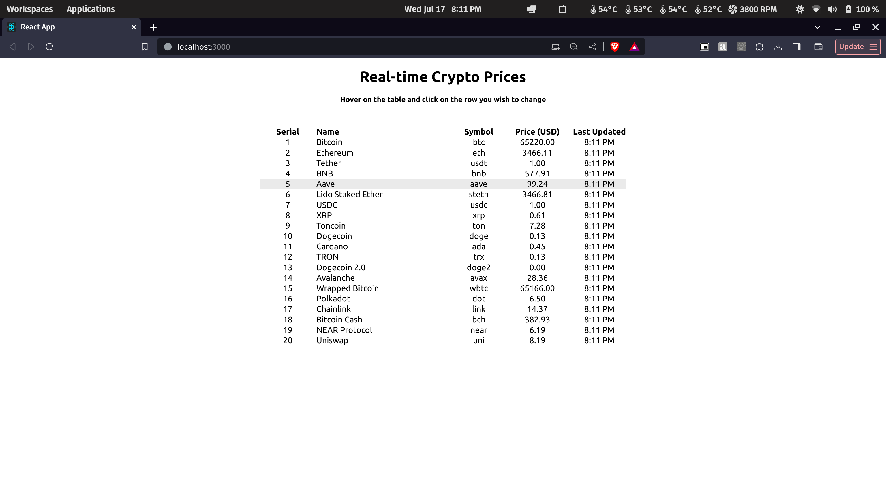
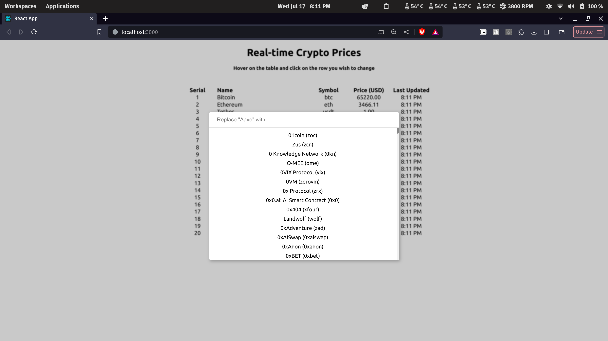
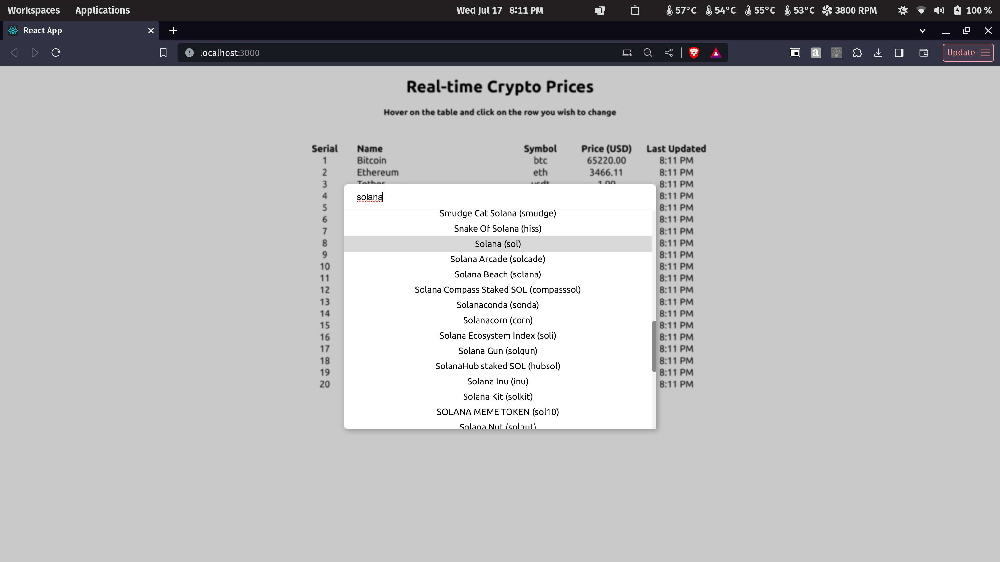
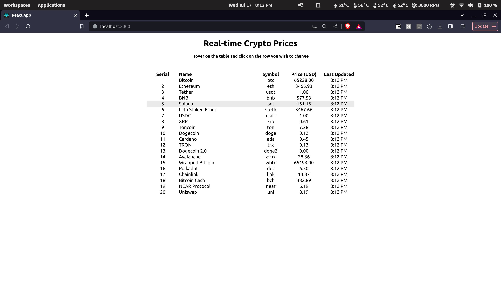

# Crypto Tracker

This project is a mini-website that collects and displays real-time price data for stocks or crypto. The project is divided into two main parts:

1. **Client**: A React application built with TypeScript.
2. **Server**: An Express.js application built with TypeScript, using the CoinGecko API and MongoDB Atlas for data storage.

## Project Structure

<pre>
Crypto-Tracker/
│
├── client/ # React application (TypeScript)
│ ├── src/
│ ├── public/
│ ├── package.json
│ ├── tsconfig.json
│ └── ...
│
└── server/ # Express.js application (TypeScript)
├── src/
├── .env # Environment variables
├── package.json
├── tsconfig.json
└── ...
</pre>

## Getting Started

### Prerequisites

- Node.js (version 14.x or higher)
- npm (version 6.x or higher)
- MongoDB Atlas account

### Setting Up the Client

1. Navigate to the `client` directory:
   ```bash
   cd client
   ```
2. Install the dependencies:
   ```bash
   npm install
   ```
3. Start the React application:
   ```bash
   npm start
   ```
   The React application will run on http://localhost:3000.

### Setting Up the Client

1. Navigate to the `server` directory:
   ```bash
   cd server
   ```
2. Create a .env file in the server directory with the following keys:
   ```makefile
   API_URL=https://api.coingecko.com/api/v3
   API_KEY=your_coingecko_api_key
   PORT=5000
   DB_URI=your_mongodb_atlas_uri
   ```
3. Install the dependencies:
   ```bash
   npm install
   ```
4. Start the Express server:
   ```bash
   npm start
   ```
   The Express server will run on http://localhost:5000.

### Usage

After starting both the client and server, you can navigate to http://localhost:3000 to interact with the application. The client will make API requests to the server to fetch real-time price data from the CoinGecko API and display it on the website.

### Screenshots





